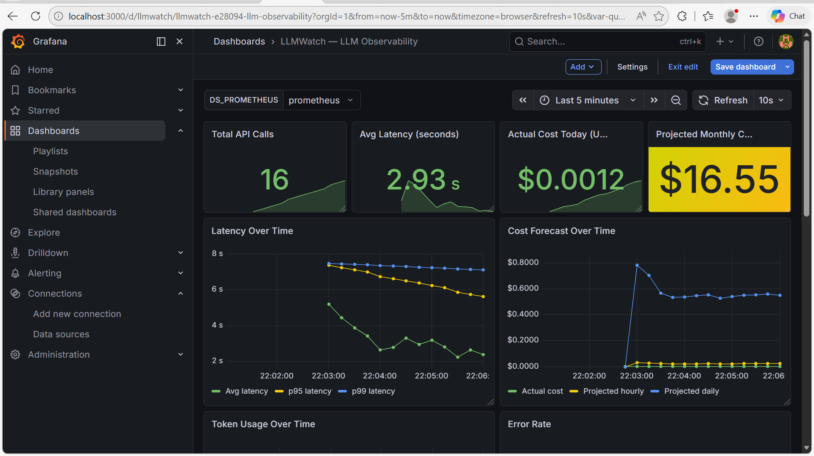
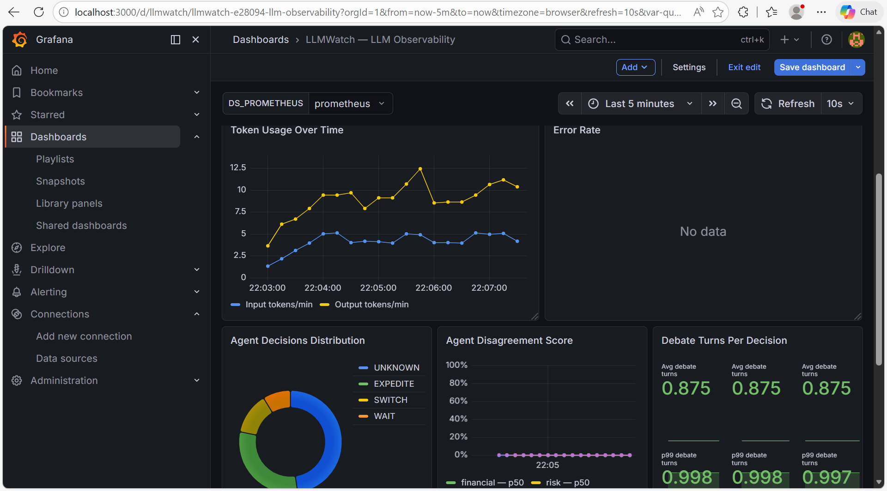
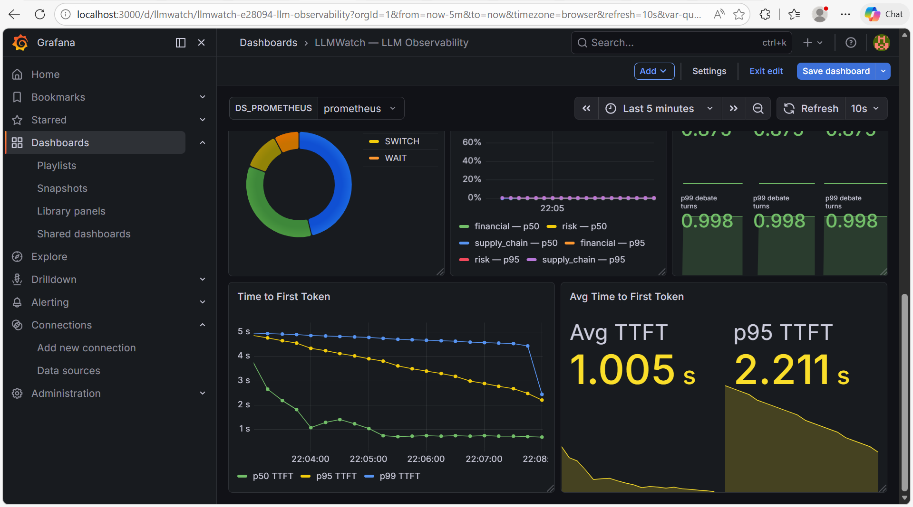

# LLMWatch


Generic LLM observability middleware for Python. Track latency, cost, TTFT, and multi-agent metrics across any LLM provider with Prometheus and Grafana.

---

## Live dashboard

### Latency, cost, and cost forecasting



Real-time tracking of avg latency, p95/p99 percentiles, actual cost, and projected monthly spend — updated every 10 seconds.

### Token usage and agent decisions



Input vs output token rates per minute, and real agent decision distribution (WAIT / EXPEDITE / SWITCH / UNKNOWN) parsed directly from LLM responses.

### Agent metrics and TTFT



Time to First Token (TTFT) — p50, p95, p99 — measured via streaming across all providers. Avg TTFT: ~1s. Separate from total latency so you know what the user actually feels.

---

## What it does

LLMWatch wraps any LLM API call and automatically records:

- **Latency** — request duration, p95/p99 percentiles, time to first token
- **Cost** — actual spend + hourly/daily/monthly forecasting with sliding window
- **Tokens** — input and output token usage per provider and model
- **Reliability** — errors (counted once per request, not per retry), retries, success rate
- **Multi-agent** — disagreement scores, debate turns, real decision distribution

---

## Supported providers

| Provider | Models |
|---|---|
| OpenAI | gpt-4o, gpt-4o-mini, o1 |
| Anthropic | claude-sonnet-4-6, claude-opus-4-6 |
| Groq | llama, mixtral |

---

## Quickstart

### 1. Clone and install dependencies

```bash
git clone https://github.com/adithi2905/LLMWatch
cd LLMWatch
pip install prometheus-client python-dotenv openai anthropic groq
```

### 2. Set environment variables

```bash
export OPENAI_API_KEY=your_key_here
export LLM_MODEL=gpt-4o-mini
```

### 3. Wrap your LLM calls

```python
from llmwatch import LLMWatch

watch = LLMWatch(provider="openai", model="gpt-4o-mini")

response = watch.call(
    messages=[{"role": "user", "content": "What is supply chain disruption?"}]
)

print(response["content"])
print(f"Cost:     ${response['cost_usd']:.6f}")
print(f"Duration: {response['duration']:.2f}s")
print(f"TTFT:     {response['ttft']:.3f}s")
```

### 4. Start Prometheus and Grafana

```bash
docker-compose up
```

### 5. Expose metrics

```python
from prometheus_client import start_http_server
start_http_server(8000)
```

### 6. Import Grafana dashboard

1. Open `http://localhost:3000`
2. Dashboards → Import → Upload `dashboards/llmwatch.json`
3. Set `DS_PROMETHEUS` variable to your Prometheus datasource
4. Click Import

Full observability in under 5 minutes.

---

## Multi-agent support

```python
from llmwatch.metrics import record_agent_metrics

record_agent_metrics(
    agent_name="supply_chain",
    disagreement_score=0.42,
    debate_turns=3,
    decision="EXPEDITE",
    confidence=0.86
)
```

---

## Custom pricing

Add a `prices.json` file and set the environment variable:

```bash
export LLMWATCH_PRICING_PATH=./prices.json
```

```json
{
    "gpt-4o":      {"input": 0.0025,   "output": 0.010},
    "gpt-4o-mini": {"input": 0.000150, "output": 0.000600}
}
```

Unknown models emit a warning and record `$0.00` rather than crashing.

---

## Metrics reference

### Latency

| Metric | Type | Description |
|---|---|---|
| `llm_request_duration_seconds` | Histogram | Total request latency |
| `llm_time_to_first_token_seconds` | Histogram | Time to first token via streaming |

### Cost

| Metric | Type | Description |
|---|---|---|
| `llm_input_tokens_total` | Counter | Total input tokens |
| `llm_output_tokens_total` | Counter | Total output tokens |
| `llm_actual_cost_usd_total` | Counter | Cumulative cost in USD |
| `llm_cost_per_minute_usd` | Gauge | Current spend rate |
| `llm_projected_hourly_cost_usd` | Gauge | Projected hourly cost |
| `llm_projected_daily_cost_usd` | Gauge | Projected daily cost |
| `llm_projected_monthly_cost_usd` | Gauge | Projected monthly cost |

### Reliability

| Metric | Type | Description |
|---|---|---|
| `llm_errors_total` | Counter | Errors per failed request (not per retry) |
| `llm_retries_total` | Counter | Total retry attempts |

### Multi-agent

| Metric | Type | Description |
|---|---|---|
| `llm_agent_disagreement_score` | Histogram | Agent disagreement (0–1) |
| `llm_agent_debate_turns` | Histogram | Turns before decision |
| `llm_orchestrator_decisions_total` | Counter | WAIT / EXPEDITE / SWITCH distribution |
| `llm_agent_confidence_score` | Histogram | Per-agent confidence score |

---

## Project structure

```
llmwatch/
├── llmwatch/
│   ├── __init__.py       — package entry point
│   ├── middleware.py     — core LLMWatch class
│   ├── metrics.py        — prometheus metrics + cost forecasting
│   ├── logger.py         — sqlite structured logging
│   ├── prompts.py        — agent prompt templates
│   └── prices.json       — default pricing config
├── dashboards/
│   └── llmwatch.json     — grafana dashboard (import ready)
├── tests/
│   └── test_unit.py      — 10 unit tests, CI-safe
├── test_llmwatch.py      — integration test (requires API key)
├── prometheus.yml        — prometheus scrape config
└── docker-compose.yml    — prometheus + grafana stack
```

---

## Requirements

```
python >= 3.10
prometheus-client
python-dotenv
openai / anthropic / groq  (install whichever you use)
```

---

## License

MIT — built by Adithi Varadarajan
